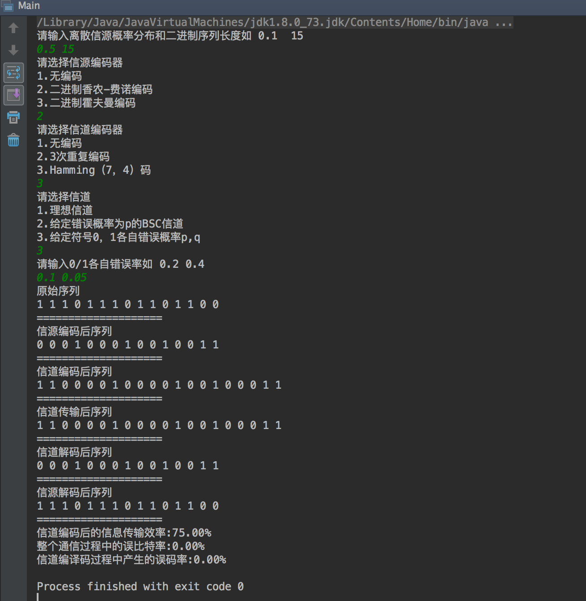
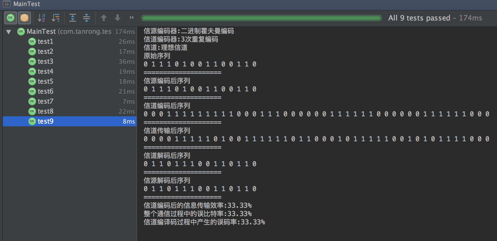
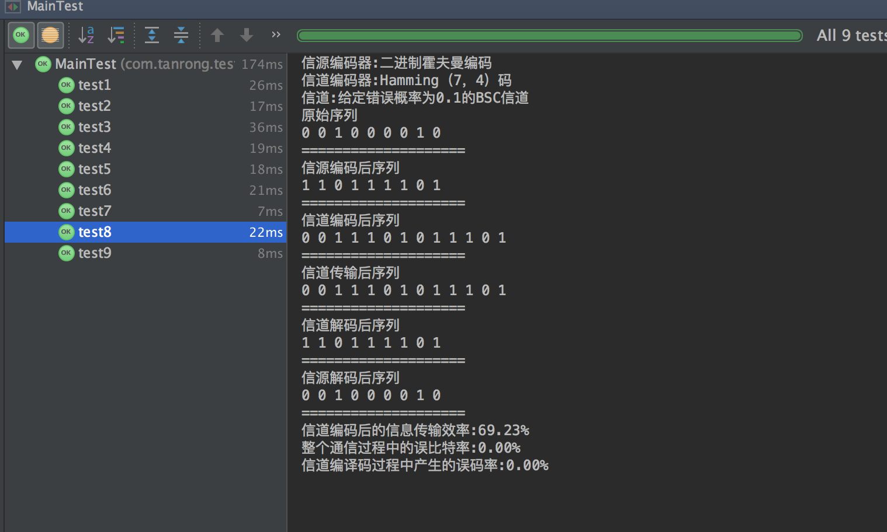
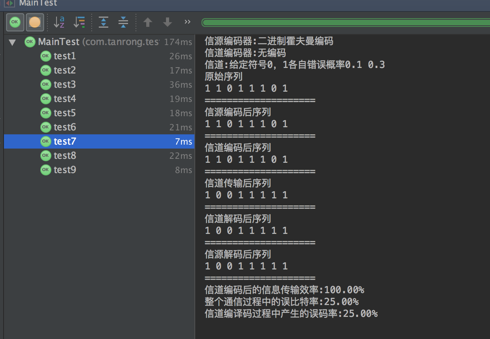
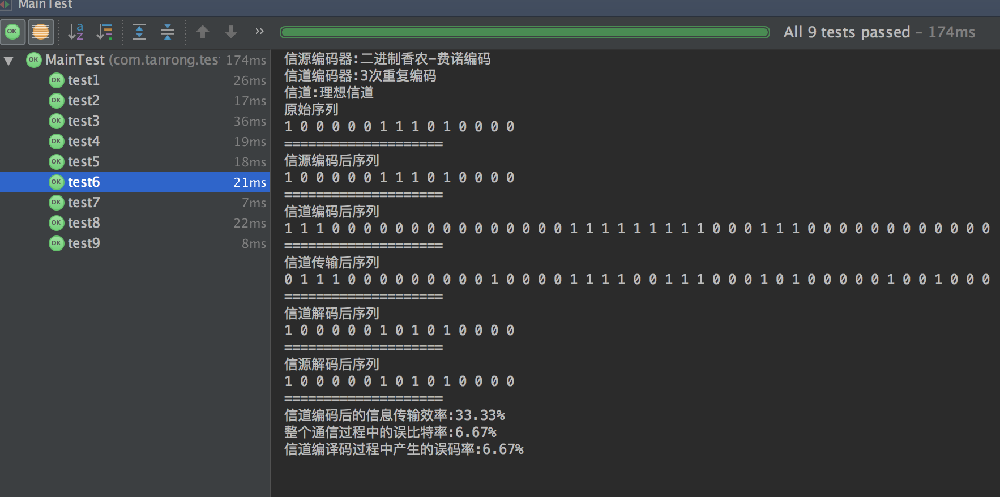
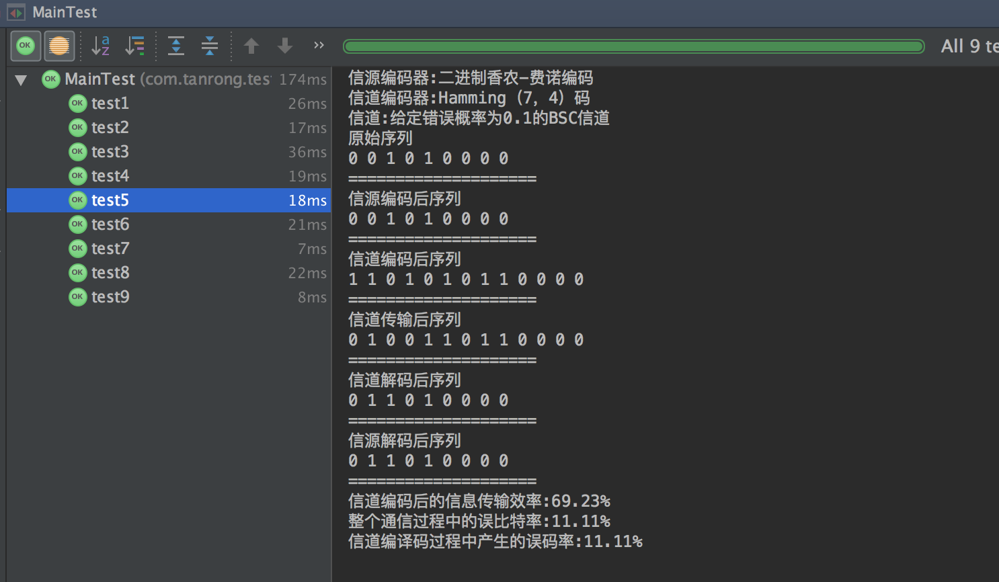
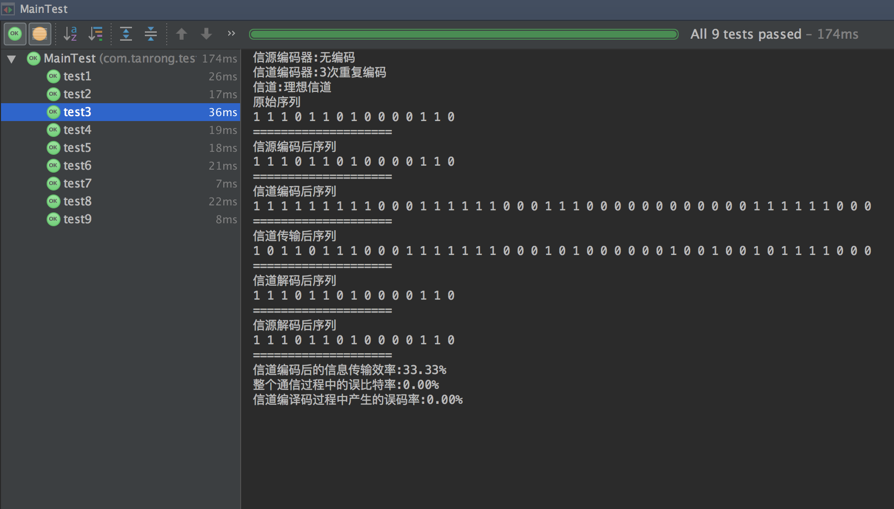
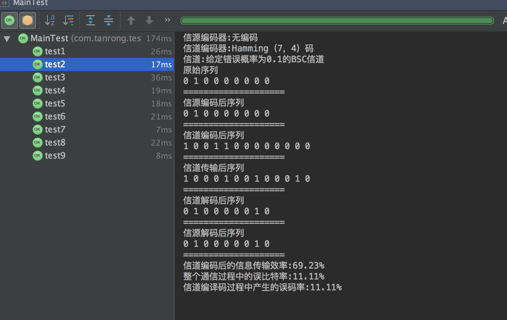
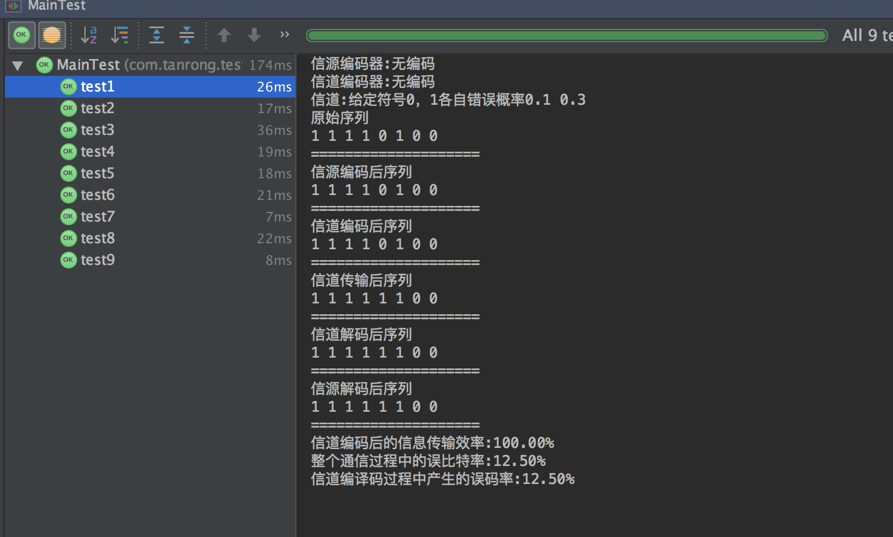

# 通信系统仿真

#实验目的
这是一个综合性的大型实验，通过搭建一个包括信源、信源编译码器、信道、信道编译码器等各模块在内的仿真通信系统，
使学生能够加深对本课程各个重点章节的理解，更好地掌握通信的本质意义。

说明：
由于搭建一个完整通信系统的工作量较大，所以本实验可以使用Matlab等仿真工具。下面分别描述系统中各个模块的要求。本程序只使用了java
1. 离散信源：要求能以指定的概率分布（p，p-1）产生0，1符号构成的二进制信源符号序列。
2. 信源编码器：输入时上一步产生的二进制符号序列。要求能选择以下三种中的任意一种
  1.无编码（直通）
  2.二进制香农-费诺编码
  3.二进制霍夫曼编码
当我们在上一步中指定信源的概率分布之后，就可以马上生成这几种编码的码表，实际的编码工作仅仅只是查表而已。
当然，直接对上一步指定的信源进行编码是不合适的，需要先进行信源的扩展，换一句话说，需要确定信源分组的长度。
这个长度N也是本系统的一个重要参数，是在系统运行之前由用户输入的。
3. 信道编码器：输入是信源编码器输出的二进制符号序列。编码方式要求能选择以下三种中的任意一种
  1.使用无编码
  2.3次重复编码
  3.Hamming（7，4）码
信道编码器是个简单的一一对应的函数转换模块，没有额外的控制参数，可以事先实现这三种编码器，统一其输入输出格式，运行时按照指定的类型直接使用即可。
4. 信道： 其输入时信道编码器输出的二进制符号序列。经过传输后输出被噪声干扰和损坏了的二进制符号序列。
要求能够模拟理想信道、给定错误概率为p的BSC以及给定符号0，1各自错误概率p,q的任意二进制信道。
5. 信道译码器： 由于信源经过信源编码器和信道编码器后的统计特性难以明确给出，所以此时理想译码器准则无法实施。
因此根据第四步给出的信道统计特性，选择采用极大似然译码准则进行译码。

6. 信源译码器：在第二步确定信源编码器之后即可同时确定信源译码器。信源译码器的工作仅仅是简单的查表即可。

#实验要求：
输入： 各个模块的相关参数
输出：
  1.信源产生的原始符号序列
  2.信源译码器输出的符号序列
  3.信道编码后的信息传输效率
  4.整个通信过程的误比特率（BER）
  5.信道编译码过程中产生的误码率（BLER）

# 运行截图

